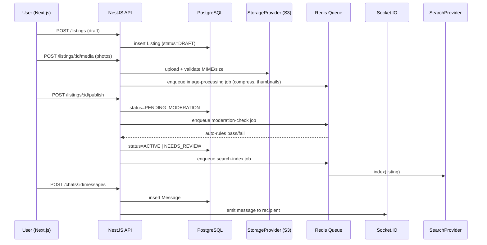

# ВЖИК — Architecture

## 1. Принцип

**Modular Monolith.** Один деплойований бекенд-застосунок, розділений на модулі з чіткими межами (bounded contexts), окремими схемами БД (schema-per-module у PostgreSQL) та забороною прямих імпортів між модулями — тільки через публічні module-level сервіси/інтерфейси. Це дозволяє в майбутньому винести окремий модуль (найімовірніше Search, Chat або Media) у окремий сервіс без переписування бізнес-логіки.

## 2. Технологічний стек

| Шар | Технологія | Причина |
|---|---|---|
| Frontend | Next.js + TypeScript | SSR/SSG для SEO, файлова маршрутизація, App Router для category/listing landing pages |
| Backend | NestJS + TypeScript | Модульна структура з коробки (Nest Modules 1:1 з bounded contexts), DI, guards/interceptors для RBAC та валідації |
| Database | PostgreSQL | Реляційна цілісність, Full Text Search на MVP, JSONB для гнучких attribute values |
| Cache | Redis | Сесії, rate limiting, кеш пошукових запитів, черги (BullMQ) |
| Realtime | Socket.IO (over Redis adapter) | Чат, typing indicator, online status, unread count push |
| Object Storage | S3-compatible (AWS S3 / MinIO для dev) | Фото/відео через абстракцію `StorageProvider` |
| Infra | Docker + Docker Compose | Локальна розробка та перше production-розгортання |
| Search | PostgreSQL FTS (MVP) за `SearchProvider` абстракцією | Легкий шлях міграції на OpenSearch/Elasticsearch без зміни domain-коду |

## 3. Модулі (bounded contexts)

```
apps/
  api/                      # NestJS backend
    src/
      modules/
        auth/
        users/
        profiles/
        location/
        categories/
        attributes/
        listings/
        media/
        search/
        favorites/
        saved-searches/
        chat/
        notifications/
        reports/
        moderation/
        anti-fraud/
        admin/
        audit/
        analytics/
      shared/                # cross-cutting: guards, pipes, decorators, error format
      providers/             # абстракції зовнішніх залежностей
        payment/             # PaymentProvider (не реалізовано в MVP)
        shipping/            # ShippingProvider (не реалізовано в MVP)
        notification/        # EmailProvider, PushProvider, InAppProvider
        storage/             # StorageProvider (S3-compatible)
        search/              # SearchProvider (Postgres FTS → OpenSearch)
  web/                       # Next.js frontend
  admin/                     # Admin Panel (окремий Next.js застосунок або /admin route group)
```

Примітка щодо розділу 22 вихідного документа («Admin — окрема адміністративна частина») та розділу 34 (модуль `Admin` у списку модулів backend): це два різні шари — `admin` backend-модуль надає API з підвищеними правами, окремий frontend `admin/` — інтерфейс. Обидва тримаються в одному репозиторії (monorepo, напр. Turborepo/Nx).

## 4. Ключові абстракції (interfaces)

```ts
interface PaymentProvider {
  createPayment(order: Order): Promise<PaymentIntent>;
  confirmPayment(id: string): Promise<PaymentResult>;
  refund(id: string, amount?: Money): Promise<RefundResult>;
}
// MVP: NoopPaymentProvider (не викликається з бізнес-логіки, лише каркас)

interface ShippingProvider {
  getBranches(cityId: string): Promise<Branch[]>;
  createWaybill(shipment: Shipment): Promise<Waybill>;
  trackWaybill(id: string): Promise<TrackingStatus>;
}
// Phase 2+: NovaPoshtaProvider implements ShippingProvider

interface NotificationChannel {
  send(userId: string, notification: NotificationPayload): Promise<void>;
}
// InAppChannel (MVP), EmailChannel (каркас), PushChannel (каркас)

interface SearchProvider {
  index(listing: ListingDocument): Promise<void>;
  remove(listingId: string): Promise<void>;
  search(query: SearchQuery): Promise<SearchResult>;
}
// PostgresFtsSearchProvider (MVP) → OpenSearchProvider (Phase 6+)

interface StorageProvider {
  upload(file: Buffer, meta: FileMeta): Promise<StoredFile>;
  delete(key: string): Promise<void>;
  getSignedUrl(key: string): Promise<string>;
}

interface ContentModerationProvider {
  checkText(text: string, context: ModerationContext): Promise<ModerationVerdict>;
}
// MVP: RuleBasedModerationProvider (forbidden-words + heuristics, decisions.md DEC-08)
// Phase 2+: AiModerationProvider (сторонній API) — підключається без зміни domain-коду
```

`SettingsService` (backed by `app_settings` таблиця, кешується в Redis) надає конфігуровані бізнес-параметри без хардкоду: ліміт активних оголошень (`decisions.md` DEC-05), PII retention period (DEC-04), forbidden-words списки для модерації (DEC-08) тощо — усе редагується з Admin Panel.

Ці інтерфейси — контракт, до якого прив'язується domain-логіка модулів `listings`, `chat`, `moderation`; конкретна реалізація підключається через DI-токен і змінюється без зміни викликаючого коду.

## 5. Схема взаємодії (MVP request flow)



## 6. State Machine (Listing)

```
DRAFT → PENDING_MODERATION → ACTIVE → RESERVED → SOLD
                            ↘ REJECTED
ACTIVE → EXPIRED
ACTIVE/RESERVED → ARCHIVED
ANY (крім SOLD/ARCHIVED) → BLOCKED (адмін/модерація)
```

Реалізується у `listings` модулі через явний State Machine (напр. XState або власний guard-based transition table), недопустимі переходи відхиляються на рівні domain service, не тільки на рівні API-валідації.

## 7. Cross-cutting concerns

- **RBAC**: `@Roles()` decorator + `RolesGuard`, ролі: guest, user, moderator, admin, system.
- **Error format**: єдиний JSON envelope `{ error: { code, message, details, traceId } }`.
- **Audit**: interceptor на всіх admin/moderation mutating endpoints → запис у `audit_log`.
- **Rate limiting**: Redis-based, per-IP і per-user (окремо жорсткіше для OTP, chat message send, listing create).
- **i18n-ready**: тексти через translation keys навіть у MVP (тільки uk.json), щоб уникнути хардкоду для майбутньої локалізації.

## 8. Чому не мікросервіси зараз

Команда і навантаження на старті не виправдовують операційну складність мікросервісів (окремі деплойменти, distributed transactions, service discovery). Modular Monolith з жорсткими межами модулів дає 90% переваг (незалежна розробка, тестованість, змога виділити сервіс пізніше) без накладних витрат. Кандидати на виділення першими за навантаженням: **Search** (CPU/IO-важкий), **Media processing** (CPU-важкий), **Chat** (stateful WS-з'єднання).
