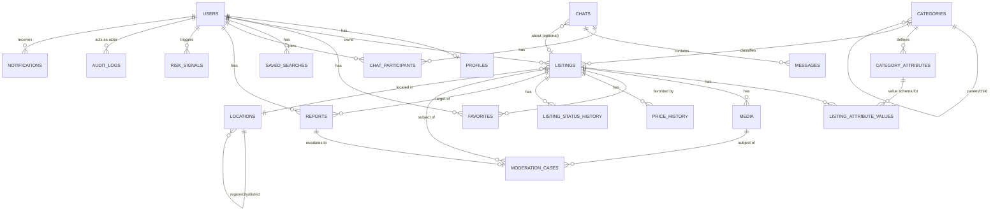

# ВЖИК — Database Design (ERD)

PostgreSQL. Усі таблиці: `id UUID PK`, `created_at`, `updated_at`, soft delete через `deleted_at NULL` (крім append-only таблиць: audit_log, messages, price_history, listing_status_history).

## 1. ERD (основні сутності)

## 2. Ключові таблиці

### users
`id, phone (unique, nullable), phone_verified_at, email (unique, nullable), google_id (unique, nullable), password_hash (nullable — passwordless за замовч.), role (enum: user/moderator/admin/system), status (enum: active/blocked/deleted), created_at, last_active_at`

### otp_codes
`id, user_id_or_phone, code_hash, purpose (login/verify), attempts_count, max_attempts, expires_at, consumed_at, created_ip` — код ніколи не зберігається у відкритому вигляді (хеш + сіль); rate limit і TTL на рівні Redis + БД.

### profiles
`id, user_id (FK unique), avatar_media_id, display_name, username (unique), city_location_id, bio, rating (nullable, підготовлено), reviews_count (nullable), active_listings_count (denormalized)`

`active_listings_count` — денормалізований лічильник, синхронізується при кожній зміні `listings.status`; використовується для enforcement ліміту **5 активних оголошень на звичайного користувача** (`decisions.md` DEC-05). Значення ліміту не хардкодиться — читається з `app_settings`/Admin Panel (конфігурований per-role: user/verified/business — з окремими значеннями в майбутньому).

### locations
`id, parent_id (self-FK), level (enum: country/region/city/district), name_uk, slug, lat, lng` — seed: Україна → 24 області + Крим → великі міста → райони.

### categories
`id, parent_id (self-FK, nullable), name_uk, slug, icon, sort_order, is_active, level (0=root..2=sub-sub)`
Unique: `(parent_id, slug)`. Індекс на `parent_id` для швидкого дерева.

### category_attributes
`id, category_id (FK), key, label_uk, data_type (enum: string/number/boolean/enum/multi_enum/range), enum_options (JSONB, nullable), is_required, is_filterable, sort_order`

### listings
`id, user_id (FK), category_id (FK), listing_type (enum: sell/buy/exchange/give_away/service/rent), title, description, price (numeric, nullable — не обов'язкова для "Куплю"/"Віддам безкоштовно"), currency (enum: UAH/USD/EUR), is_negotiable (bool), condition (enum: new/used/for_parts, nullable per category), location_id (FK), status (enum — див. §6 architecture.md), views_count (denormalized), published_at, expires_at`
Індекси: `(category_id, status, published_at desc)`, `(user_id, status)`, GIN на FTS-вектор `search_vector`.

### listing_attribute_values
`id, listing_id (FK), category_attribute_id (FK), value_text, value_number, value_boolean, value_json` — гнучке зберігання за `data_type` з `category_attributes` (одна з колонок заповнена залежно від типу; альтернатива — єдина JSONB-колонка `value JSONB` з валідацією на рівні застосунку — обране рішення для MVP, простіше в підтримці).
Unique: `(listing_id, category_attribute_id)`.

### media
`id, listing_id (FK, nullable — може належати chat message), owner_user_id, storage_key, mime_type, size_bytes, width, height, is_main (bool), sort_order, moderation_status (enum), created_at`

### moderation_cases
`id, target_type (enum: listing/media/user/chat_message), target_id, status (enum: PENDING/APPROVED/REJECTED/NEEDS_REVIEW), auto_flags (JSONB), assigned_moderator_id (nullable), decision_reason, decided_at, report_id (FK, nullable)`

### reports
`id, reporter_user_id (FK), target_type (enum: listing/user/chat), target_id, reason (enum — див. §20 вихідного документа), description, evidence_media_ids (uuid[]), status (enum: new/in_review/resolved/rejected), moderator_decision, created_at`

### favorites
`id, user_id (FK), listing_id (FK), created_at` — unique `(user_id, listing_id)`.

### price_history
`id, listing_id (FK), old_price, new_price, currency, changed_at`

### listing_status_history
`id, listing_id (FK), from_status, to_status, actor_type (user/moderator/system), actor_id, reason, created_at`

### saved_searches
`id, user_id (FK), query_text, category_id (nullable FK), filters (JSONB), region_location_id (nullable), created_at, last_notified_at`

### chats
`id, listing_id (FK, nullable), created_at, last_message_at (denormalized)`

### chat_participants
`id, chat_id (FK), user_id (FK), unread_count (denormalized), is_blocked_by_other, last_read_at`
Unique: `(chat_id, user_id)`.

### messages
`id, chat_id (FK), sender_id (FK), text, media_ids (uuid[]), created_at, read_at (nullable)` — append-only.

### notifications
`id, user_id (FK), type (enum — див. §37), payload (JSONB), channel (enum: in_app/email/push), read_at, created_at`

### risk_signals / risk_scores
`risk_signals: id, user_id (FK), signal_type (enum), weight, metadata (JSONB), created_at`
`risk_scores: id, user_id (FK, unique), score (numeric), last_calculated_at`

### audit_logs
`id, actor_user_id (FK), action, target_type, target_id, before (JSONB), after (JSONB), ip, created_at` — append-only, ніколи не видаляється.

### app_settings
`id, key (unique), value (JSONB), description, updated_by (FK users), updated_at` — конфігурований через Admin Panel набір бізнес-параметрів без хардкоду в коді. MVP-ключі: `listing.max_active_per_user` (default `5`), `pii.retention_months` (default `6`), `moderation.forbidden_words`, rate-limit пороги. Читається через кешований (Redis) `SettingsService`.

## 3. Конкурентність і цілісність

- Optimistic locking через `updated_at`/`version` колонку на `listings` для запобігання race condition при одночасному редагуванні/зміні статусу.
- Унікальні constraints на `phone`, `email`, `google_id`, `username`.
- FK з `ON DELETE RESTRICT` для довідників (categories, locations); `ON DELETE CASCADE` для залежних деталей (listing_attribute_values, media при видаленні listing — за умови, що listing насправді soft-deleted, тому cascade фактично не спрацьовує в звичайному флоу).
- Пагінація — keyset/cursor-based на `(published_at, id)` для великих списків оголошень (offset-пагінація деградує на глибоких сторінках).

## 4. Індекси (мінімальний набір MVP)

- `listings(category_id, status, published_at DESC)`
- `listings(user_id, status)`
- `listings USING GIN (search_vector)`
- `listings(location_id)`
- `listing_attribute_values(listing_id)`, `(category_attribute_id, value_text)` для фільтрів
- `messages(chat_id, created_at)`
- `favorites(user_id)`, `(listing_id)`
- `reports(status, created_at)`
- `audit_logs(actor_user_id, created_at)`
